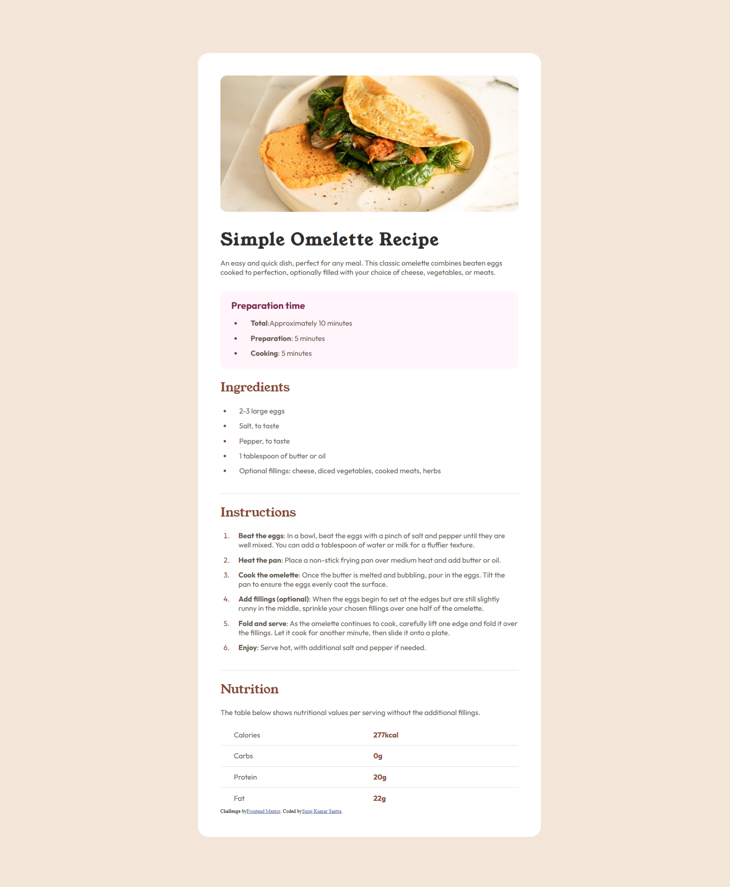
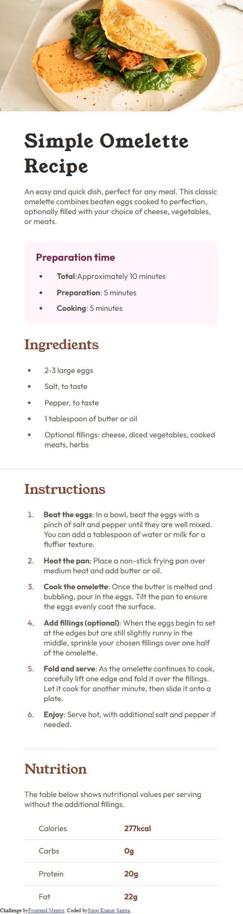

# Frontend Mentor - Recipe page solution

This is a solution to the [Recipe page challenge on Frontend Mentor](https://www.frontendmentor.io/challenges/recipe-page-KiTsR8QQKm). Frontend Mentor challenges help you improve your coding skills by building realistic projects. 

## Table of contents

- [Overview](#overview)
  - [The challenge](#the-challenge)
  - [Screenshot](#screenshot)
  - [Links](#links)
- [My process](#my-process)
  - [Built with](#built-with)
  - [What I learned](#what-i-learned)
  - [Continued development](#continued-development)
  - [Useful resources](#useful-resources)
- [Author](#author)


## Overview

This is a basic recipe page which is built by using HTML and CSS only.

### Screenshot





### Links

- Solution URL: [checkout the solution](https://github.com/Batman-0001/recipe-page-project-frontend-mentor)
- Live Site URL: [checkout the live website](https://batman-0001.github.io/recipe-page-project-frontend-mentor/)

## My process

The process of building this project was very tiring. It took me two days to complete this project. I have used a desktop-first approach, in which, basically, I build the project corresponding to the desktop first and then try to adjust it for different screen sizes (tablets, mobiles, etc.). Also, I have to edit the HTML and CSS I have written previously at some steps in order to get the solution. 

### Built with

- Semantic HTML5 markup
- CSS custom properties
- Flexbox
- Desktop-first workflow


### What I learned

I have never worked on an extensive design project like this before, so I have learned a few new things doing this project. Firstly, I have learned about responsive design and how to use media queries effectively to do responsive designs. Secondly, I have learned about how to design lists, for example, by giving space between the circle and the line, etc. And finally, I have learned patience, yes, because these types of projects require so much analysis on how much space is required, which colour to use, what the font size should be, etc., so having patience throughout the project is the key.

Below are some code snippets:

```html
<ul class="prep-time">
     <li><div><span>Total</span>:Approximately 10 minutes</div></li>
     <li><div><span>Preparation</span>: 5 minutes</div></li>
     <li><div><span>Cooking</span>: 5 minutes</div></li>
</ul>
```
```css
@media screen and (max-width: 1000px) {
    body{
        background-color: hsl(30, 54%, 90%);
        margin-top: 10vh;
        margin-bottom: 10vh;
    }
    
    main{
        width: 45vw;
        background-color: hsl(0, 0%, 100%);
        position: relative;
        left: 23vw;
        padding: 3vw;
        border-radius: 1.5em;
    }
}

```


### Continued development

Doing this project I got to know that I am still not very good in doing responsive designs and designing tables using CSS. So I will be focusing more on these areas to become more proficient.


### Useful resources

- [resource](https://developer.mozilla.org/en-US/) - This helped me as I had to read documentations of HTML and CSS to review some of the elements in HTML and properties in CSS.

## Author

- Website - [Suraj Kumar Santra](https://github.com/Batman-0001)
- Frontend Mentor - [@Batman-0001](https://www.frontendmentor.io/profile/Batman-0001)
- Twitter - [@SurajKSantra001](https://www.twitter.com/SurajKSantra001)


